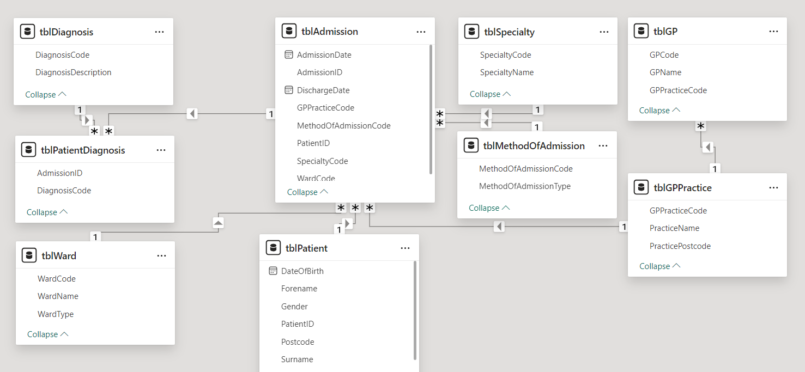
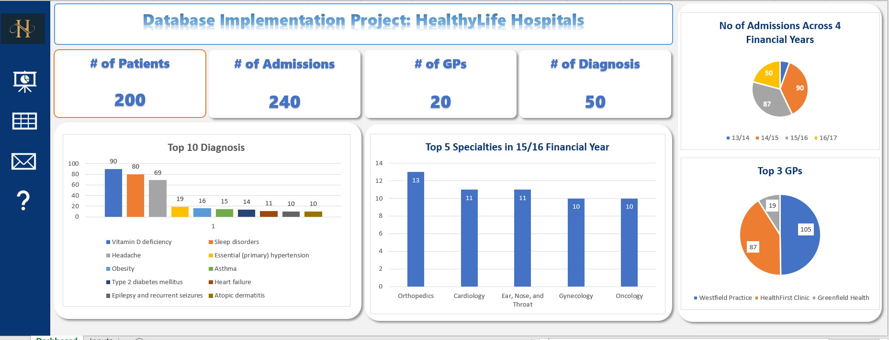

# HealthyLife Hospitals Database Implementation Project

## Introduction
This project *Database Implementation* was developed using MSSQL. See scenario below.

#### Scenario
*You have been hired as a database developer for HealthyLife Hospitals. The management requires a comprehensive database to manage patient admissions, diagnoses, wards, and related information. This database will aid in analyzing patient admissions, understanding common diagnoses, and optimizing hospital operations. Your task is to design, implement, and populate a database, and write queries to extract valuable insights from the data.*


### 1. Database Design

Database Name: *HealthyLifeStyle*

The database consists of 9 tables:

- *tblPatient*: Stores patient basic information like forename, surname, gender, etc
- *tblAdmission*: Records patient's hospital admission
- *tblSpecialty*: Lists medical specialties
- *tblWard*: Contains ward information
- *tblMethodOfAdmission*: Defines admission methods
- *tblDiagnosis*: Stores diagnosis information i.e diagnosis code and its description
- *tblPatientDiagnosis*: Stores patient's diagnosis
- *tblGP*: Contains Doctors details
- *tblGPPractice*: Stores GP (hospital) information

Relationships are established using foreign keys as specified in the table structures.



### 2. Data Insertion

Sample data is populated into all tables, with at least 100 records for admissions, patients, and patient diagnoses to allow for meaningful analysis.

### 3. T-SQL Queries

The project includes several T-SQL queries to extract valuable insights:

1. Patient and Admission Details
2. Admission Analysis
3. Diagnosis and Treatment Analysis
4. GP and Practice Analysis
5. Comprehensive Episode Analysis
6. Additional Data Retrieval

These queries cover various aspects of hospital operations, including patient admissions, diagnoses, ward utilization, and GP referrals.

### 4. Implementation Steps

1. Create the database using *HealthyLifeStyle* SQL CREATE DATABASE statement. 
```
IF NOT EXISTS(SELECT * FROM sys.databases WHERE name = 'HealthyLifeStyle')
    BEGIN
        CREATE DATABASE HealthyLifeStyle;
    END;
    GO
    
USE HealthyLifeStyle;
GO
```
2. Create the table schema using SQL CREATE TABLE statements
```
CREATE TABLE tblPatient(
    PatientID  INT IDENTITY(1,1) PRIMARY KEY,
    Forename NVARCHAR(50) NOT NULL,
    Surname NVARCHAR(50) NOT NULL,
    DateOfBirth DATE NOT NULL,
    Gender NVARCHAR(20) NOT NULL,
    Postcode NVARCHAR(15) NOT NULL
);
```
3. Establish relationships between tables using foreign key constraints
```
CREATE TABLE tblAdmission (
    AdmissionID INT IDENTITY(1,1) PRIMARY KEY,
    PatientID INT FOREIGN KEY REFERENCES tblPatient(PatientID),
    AdmissionDate DATE NOT NULL,
    DischargeDate DATE NOT NULL,
    SpecialtyCode NVARCHAR(20) FOREIGN KEY REFERENCES tblSpecialty(SpecialtyCode),
    WardCode NVARCHAR(20) FOREIGN KEY REFERENCES tblWard(WardCode),
    MethodOfAdmissionCode NVARCHAR(20) FOREIGN KEY REFERENCES tblMethodOfAdmission(MethodOfAdmissionCode),
    GPPracticeCode NVARCHAR(20) FOREIGN KEY REFERENCES tblGPPractice(GPPracticeCode)
);
```
4. Insert sample data into all tables
```
-- Insert 20 records into the tblGPPractice table
INSERT INTO tblGPPractice (
    GPPracticeCode, 
    PracticeName, 
    PracticePostcode
) VALUES
    ('GP001', 'HealthFirst Clinic', 'AB12 3CD'),
    ('GP002', 'Wellness Medical Center', 'BC23 4DE'),
    ('GP003', 'CityCare GP Practice', 'CD34 5EF'),
    ('GP004', 'Greenfield Health', 'DE45 6FG'),
    ('GP005', 'Pinewood Medical', 'EF56 7GH'),
    ('GP006', 'Riverdale Clinic', 'FG67 8HI'),
    ('GP007', 'UrbanCare Practice', 'GH78 9IJ'),
    ('GP008', 'BrightHealth Center', 'HI89 0JK'),
    ('GP009', 'Central GP Clinic', 'IJ90 1KL'),
    ('GP010', 'Northview Medical', 'JK01 2LM'),
    ('GP011', 'Southside Health', 'KL12 3NO'),
    ('GP012', 'Westfield Practice', 'LM23 4OP'),
    ('GP013', 'Eastwood Medical Center', 'MN34 5PQ'),
    ('GP014', 'Village Health Clinic', 'NO45 6QR'),
    ('GP015', 'Main Street GP', 'OP56 7RS'),
    ('GP016', 'Sunrise Clinic', 'PQ67 8ST'),
    ('GP017', 'HealthPlus Practice', 'QR78 9TU'),
    ('GP018', 'FamilyCare Medical', 'RS89 0UV'),
    ('GP019', 'Oakwood GP Practice', 'ST90 1WX'),
    ('GP020', 'Harmony Health Center', 'TU01 2XY');
```
5. Write and test T-SQL queries to extract required information. See attached word document that contains list of expected questions. *Project Questions.docx*

### 5. Project Structure

```sh
├── README.md
├── Dashboard.xlsx *** Some visualizations in excel
├── Project Questions.docx *** project questions
├── Top5GPWithLargestAdmission.sql *** used for visuals
├── Table_relationshps.png *** Table relationships image
├── setup
    ├── CreateTables.sql *** This script create a new database and all the tables required
    ├── insertion.sql *** This script populates all the tables with same data
├── Q1. Patient and Admission Details
    ├── ListAllPatients.sql
    ├── PatientsAdmission.sql
├── Q2. Admission Analysis
    ├── MaximumStay.sql
    ├── TotalAdmissionInEachWard.sql
├── Q3. Diagnosis and Treatment
    ├── MostCommonDiagnosis.sql
├── Q4. GP and Practice Analysis
    ├── GPWithLargestAdmission.sql
├── Q5. Comprehensive Episode Analysis
    ├── AdmissionEpisodes.sql
├── Q6. Additional Data Retrieval
    ├── GPWithMostPatients.sql
    ├── ICUPatients.sql
    ├── PatientsWithMoreThanOneAdmission.sql
    ├── Top5Specialties.sql
    ├── WardAverageLengthOfStay.sql

```

### 6. How To Run This Project

To run this project successfully, *Run the 2 scripts inside the setup folder. Run the CreateTables.sql first before running the insertion.sql*


### 7. Data Visualization
Some visualization were performed using excel. The excel file can be found in this repository. See screenshot below.


